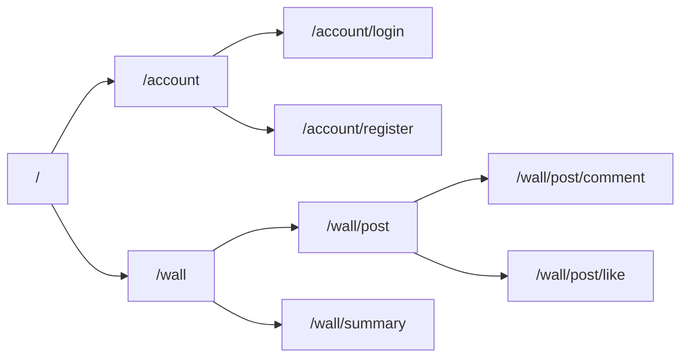
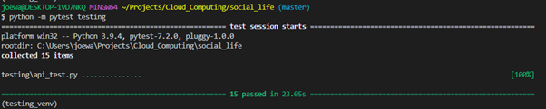

# Social Life – Documentation

TODO:
Proof read.
Add references.


## 1. Overview
Social life is a minimalist microblogging app with a REST API interface. Users can create accounts, post short updates to a ‘wall’, and view, comment on, and 'like' other users’ updates.

## 2. Implementation
Social life is implemented in NodeJS using express, with a MongoDB database using Mongoose 3rd party library.

### 2.1 Models

Social life has a simple database structure based around two collections of records: Users and WallPosts.

#### 2.1.1 User:
User records are very simple, containing only basic user details:

```JSON
{
_id: ObjectID,
Username: String,
Password: str
}
```
#### 2.1.2 WallPost:

WallPosts contain all the details of a post. They also contain the details of all comments and user “likes” relating to that post, in a nested structure. Comments and likes are stored here, rather than in a separate collection with a primary key, because we primarily want to access this data in relation to posts (so this saves us lots of querying).

Comments and likes are associated with the user that posted them. This allows users to better build relationships and have meaningful dialogues. It is also useful for ensuring that users cannot ‘like’ a post multiple times.

```JSON
{
	owner: ObjectID,
	Tile: String,
	Text: String,
	Timestamp: Date,
	Comments: [{
		owner: ObjectID,
		timestampe: date,
		comment: String
	]},
	Likes: [{
		owner: ObjectID
	}]
}
	
```

### 2.2 URL Routing
NodeJS uses routers to direct HTTP requests to the correct application code. Social Life uses the following structure for routing URL requests. The file structure of the application code aligns with this structure.



### 2.3 Testing
Social Life includes testing for 15 specified test cases, which were part of the original requirements for this project. It also tests other areas of functionality such as input validation and CRUD operations not specified in the test cases. Testing is automated using a python script which calls the API.

The full test script for the 15 cases, and a more detailed explanation of the approach used, can be found in section 4. All tests can be found in the repo in testing/api_test.py.

The following screenshot shows the 15 test cases successfully running in pytest.
 


### 2.4 Authorisation
The app uses OAuth2 user authentication. Users have to register initially, and then subsequently are required to login to access the API’s features. When logging in, they receive a jsonwebtoken, which can then be used to authenticate further requests.
User passwords are stored in hashed and salted format for security. 

### 2.5 Input Validation
Social Life validates user inputs. For example – posts, comments, usernames and passwords all have limitations on length. 

Validation is fully documented in the full API reference in section 3.

For the most part, authentication happens in the models using Mongoose’s validation syntax. For passwords this is not possible, as they are already hashed and salted by the time they reach the database, so the function validatePassword in account.js handles this instead, before hashing and salting takes place.


### 2.6 Version Control

As I developed the app, I used github for version control. To do so I created an empty repo in GitHub, and used the following commands (I already had my login details set up in my global git config from previous projects):

```BASH
## To initialise the local repo:
git init social_life

## To connect to the remote repo:
git remote add origin <repo url>

## When commiting changes during development
git add . 
git commit -m '<commit message>'
git push origin master

# (Git 2022) 
```


### 2.7 Deployment

The app was deployed on a GCP VM using Docker. 

#### 2.7.1 Setting up the VM and docker

I set up a new VM instance, and used the browser based SSH terminal to deploy the app.

I installed docker using apt-get:
```BASH
sudo apt-get update
sudo apt-get install docker.io

# (Docker 2022f) 
```

I gave myself permissions to run docker as root without needing to use sudo:

```BASH
sudo usermod -aG sudo joewarriner40
sudo usermod -aG docker joewarriner40

# (Die.net 2022)
```

#### 2.7.2 Cloning the repo and creating a Dockerfile 
Then I cloned the github repo, using a token generated on the github site:

```BASH
git clone --branch master https://<my git username>:<my git token>@<my git repo>

# (Git 2022)
```

The --branch master argument would allow me to create additional feature branches and develop on them, while still being able to easily git fetch only the master branch from the production server.

I didn't want to put my secrets file on github, so I had included the ```.env``` file in ```.gitignore```. I therefore manually added a ```.env``` file to the repo on the VM using ```nano .env```.

Then I created a dockerfile in the repo, using ```nano Dockerfile``` with the following details:

```Docker
FROM alpine 
RUN apk add --update nodejs npm 
COPY . /src
WORKDIR /src
EXPOSE 3000
ENTRYPOINT ["node", "./app.js"]

# (Docker 2022d)
```

- ```FROM alpine``` uses the Alpine docker image, which is a lightweight Linux image (Docker 2022a)

- ```RUN apk add --update nodejs npm ``` Installs nodejs and npm (node js package manager) in the container.

- ```COPY . /src``` copies the contents of the directory containing the Dockerfile into a /src directory in the container.

- ```WORKDIR /src``` sets that /src directory to be the working directory

- ```EXPOSE 3000``` allows requests to port 3000 on the container (the one that the app is set to listen on)

- ```ENTRYPOINT ["node", "./app.js"]``` contains the commands to run the app.


#### 2.7.2 Running the container


I  built an image from the dockerfile using:

```BASH
docker image build -t social-life-image:1 .

# (Docker 2022b)
```

- ```docker image .``` is the main command. The ```.``` is a path argument, so will just use the current working directory (this was run from the repo directory on the vm).

- ```-t social-life-image:1``` is an additional argument that allows us to give the image a name and version

Finally, I ran the container:

```BASH
docker container run -d --name social-life --publish 80:3000 --log-driver=gcplogs  social-life-image:1

# (Docker 2022c)
```

- ```docker container run social-life-image:1``` is the main command that runs a container based on the image.

- ```-d``` sets the container to run in the background (i.e. without opening).

 - ```--name social-life``` gives the container a name to allow us to more easily manage it.


- ```--publish 80:3000``` sets up a connection between the port that the VM listens on (80) and the port the app is using in the container (3000). 

- ```--log-driver=gcplogs``` allows us to view logging from the app in the GCP console - invaluable for troubleshooting!  (Docker 2022)


I was then able to successfully run my tests using the python test script described below.


## 3. API Reference

### 3.1 General Information

#### Authentication

All resources under Wall require a json web token for access. This should be included in the request header under 'auth-token'.

Tokens can be obtained using account/register and account/login.


####  Errors

All end points may return one of the following two errors:

400 - Application error or invalid entry. Response will include error message generated by application.
401 - Access denied.

#### Objects:

The following object formats are returned by multiple API endpoints.

##### Wall post object:

| Field | Description |
|---|---| ---- |
| _id | Wall post unique ID.
| owner | ID of user who created post
| title| Title of post
| text| Post body.
| timestamp | Time of post.
| comments | List of comments (see below)
| likes | List of user IDs.

##### Comment object:

| Field | Description |
|---|---| 
| owner_id | ID of user who created comment 
| timestamp | Time of comment
| comment | Comment text

### 3.2 End Point Reference

#### **POST** - account/register
Register a new user.
##### Example:
```
POST <root>/account/register
```

##### Access:
Public

##### Request Body:
| Field | Description | Validation |
|---|---| ---- |
|username| Username for new user | String.  Less than 100 characters, no spaces. Unique.
|password|Username for new user | String.  More than than 8 characters, no spaces. Unique.

##### Success 200:
| Field | Description |
|---|---| ---- |
|_id| New user id
|username| Confirmation of username.
|password| Confirmation of hashed password.

##### Error 4xx:
| Field | Description | Validation |
|---|---| ---- |
|username| Username for new user | String.  Less than 100 characters, no spaces. Unique.
|password|Username for new user | String.  More than than 8 characters, no spaces. Unique.

-----

#### **POST** - account/login 
User login (get json web token). 
##### Example:
```
POST <root>/account/login
```
##### Access:
All registered users.

##### Request Body:
| Field | Description | Validation |
|---|---| ---- |
|username| Username for new user | String.  Less than 100 characters, no spaces. Unique.
|password| Username for new user | String.  More than than 8 characters, no spaces. Unique.

##### Success 200:
| Field | Description |
|---|---| ---- |
|_id| New user id
|username| Confirmation of username.
|password| Confirmation of hashed password.

##### Error 400:
| Field | Description | Validation |
|---|---| ---- |
|username| Username for new user | String.  Less than 100 characters, no spaces. Unique.
|password| Username for new user | String.  More than than 8 characters, no spaces. Unique.


-----

#### GET - wall

Return all public wall posts.

##### Example:
```
GET <root>/wall
```

##### Request Body:
None

##### Success 200:
List of wall post objects.

-----

#### GET - wall/post
Get a single wall post.

##### Example:
```
GET <root>/post/:postID
```

##### Request Body:
None

##### Success 200:
Single wall post object.

-----

#### POST - wall/post
Create a new post

##### Example:
```
POST <root>/post/
```

##### Access
All registered users.

##### Request Body:
| Field | Description | Validation |
|---|---| ---- |
|title | Title of post.  | String between 1 and 128 characters.
|text | Post body. | String between 1 and 256 characters.

##### Success 200:
Wall post object confirming details of new post.

-----
#### PATCH - wall/post
Edit a post

##### Example:
```
PATCH <root>/post/:postID
```
##### Access
Owner of target post.

##### Request Body:
| Field | Description | Validation |
|---|---| ---- |
|title | New title of post. | String between 1 and 128 characters.
|text | New post body. | String between 1 and 256 characters.

##### Success 200:
Wall post object confirming updated post details.


-----
#### DELETE - wall/post
##### Example:
```
GET <root>/delete/:postID
```

##### Access
Owner of target post.


##### Request Body:
None

##### Success 200:
Wall post object confirming deleted post details.
 


-----
#### POST - wall/post/comment
Add a comment to an existing post.


##### Example:
```
POST <root>/post/comment/
```

##### Access
All registered users except owner of target post.


##### Request Body:
| Field | Description | Validation |
|---|---| ---- |
|postId | ID of post to update. | String.  Matches existing post id.
|comment | Body of comment | String.  Between 1 and 256 characters.

##### Success 200:
Wall post object confirming details of post, including newly posted comment.


-----

#### POST - wall/post/like
Add a 'like' to a post.

##### Example:
```
POST <root>/post/like/:postId
```

##### Access
All registered users except owner of target post, and users who have previously liked post.

##### Request Body:
None

##### Success 200:
Wall post object confirming details of post, including newly posted like.


-----

#### GET - wall/summary/engagement_summary
Get summary of engagement with a users posts.


##### Example:
```
GET <root>/wall/summary/engagement_summary
```

##### Access
All registered users.

##### Request Body:
None

##### Success 200:
| Field | Description |
|---|---| ---- |
|comments| List of comment objects (all comments on current users posts.)
|likes | Number. Total number of likes of users posts. 


## 4. Testing

The following python script tests the 15 predefined test cases for the application.

Testing follows the pytest approach of: Arrange, Act, Assert, Cleanup (pytest 2020).  The "Assert" step is for each test case is handled in test functions,  with the format **test_tcXX**, where XX is the numbers 1 - 15. 

The remaining Arrange, Act, Cleanup steps are handled by 'fixtures' which are shared between the test functions. In general, fixtures call the API and pass the response to tests to make assertions, while also storing certain parts of the response (e.g. tokens). 

Fixtures build upon one another to create an end-to-end programme flow:

clear_db -> create_users -> register_users ->  get_user_tokens -> make_posts -> users_with_posts_and_comments -> users_with_posts_comments_likes

Each test specifies a fixture in the function signature. This represents the point in the programme flow that test's assertions are made.

The test script below is the version for testing locally. To test the cloud version, we simply change the BASE_URL constant to the IP address of the VM we are running on, and then run the test script again (from a local laptop). This produced the same result.


```python

import pytest
import requests
from requests import Response
from pathlib import Path
import decouple
import pymongo


# Return error if not run from correct directory.
try:
    config = decouple.Config(decouple.RepositoryEnv(Path.cwd().joinpath('.env')))
except FileNotFoundError as error:
    print('ERROR: Test script needs to be run fom same directory as .env')
    raise error


### SETUP UTILS FOR TESTING ###

# Connect to mongodb
client = pymongo.MongoClient(config.get('MONGO_DB_URL'))

## API URLS:
BASE_URL = 'http://localhost:3000/'
ACCOUNT_URL = BASE_URL + 'account/'
REGISTER_URL = ACCOUNT_URL + 'register'
LOGIN_URL = ACCOUNT_URL + 'login'
WALL_URL = BASE_URL + 'wall/'
POST_URL = WALL_URL + 'post/'
COMMENT_URL = POST_URL + 'comment/'
LIKE_URL = POST_URL + 'like/'
ENGAGEMENT_SUMMARY = WALL_URL + 'summary/engagement_summary'


class User:
    '''
    Class to hold data for test users.

    Allows us to pass around tokens, IDs, responses, etc. so we don't have 
    to enter them manually each time.
    '''
    id: str
    post_id: str
    token: str
    register_response: Response
    token_response: Response
    post_response: Response
    comment_response: Response
    like_response: Response
    post_title: str
    post_text: str
    comment: str
    post_id: str

    def __init__(self, username, password):
        self.username = username
        self.password = password


@pytest.fixture
def clear_db():
    'Clear database before test'
    yield
    for collection in client.social_life.list_collection_names():
        client.social_life.drop_collection(collection)
    

@pytest.fixture
def create_users(clear_db):
    '''Create test users'''
    olga = User('olga01', 'olga_pass')
    nick = User('nick01', 'nick_pass')
    mary = User('mary01', 'mary_pass')
    return olga, nick, mary
    

@pytest.fixture
def register_users( create_users: tuple[User, User, User]):
    '''Register the test users and store the http response'''
    users = create_users
    for user in users:
        response = requests.post(
            REGISTER_URL, 
            json = {
                'username': user.username,
                'password': user.password
            }
        )
        user.id = response.json()['_id']
        user.register_response = response
    return users
    
@pytest.fixture
def get_user_tokens(register_users: tuple[User, User, User]):
    '''Get authorisation tokens for each user and store the http response.'''
    for user in register_users:
        response = requests.post(
            LOGIN_URL, 
            json = {
                'username': user.username,
                'password': user.password
            }
        )
        user.token_response = response
        user.token = response.json()['auth_token']
    return register_users


@pytest.fixture
def make_posts(get_user_tokens: tuple[User, User, User]):
    '''Make a post for each of Olga, Mary and Nick. Store responses.'''

    olga, nick, mary = get_user_tokens

    olga.post_title = "Olga's post"
    olga.post_text = "It was a bright, cold day in April and the clocks were striking thirteen..."

    nick.post_title = "Nick's post"
    nick.post_text = "I've seen ... attack ships on fire off the shoulder of Orion ... C-beams glitter in the dark near the Tannhäuser Gate"
    
    mary.post_title = "Mary's post"
    mary.post_text = "HUMANS NEED FANTASY TO BE HUMAN. TO BE THE PLACE WHERE THE FALLING ANGEL MEETS THE RISING APE."

    for user in olga, nick, mary:
        response = requests.post(
            POST_URL,
            json = {
                'title': user.post_title,
                'text': user.post_text
            },
            headers = {'auth-token': user.token}
        )
        user.post_response = response
        user.post_id = response.json()['_id']

    return olga, nick, mary 

@pytest.fixture
def users_with_posts_and_comments(make_posts: tuple[User, User, User]):
    '''Attempt to add comments to Mary's post for each user. Store responses.'''

    olga, nick, mary = make_posts

    nick.comment = 'Mary - why is this all in capitals?'

    olga.comment = """ 
        It's a quote from the character Death in Terry Pratchett's Disworld.
        Also why did you ask Mary? You know she can't reply to her own post!
        """

    mary.comment = """ 
        Actually I CAN reply because the idiot developing this app hasn't finished coding it yet. 
        He said something about "test driven development".
        """

    for user in nick, olga, mary:
        response = requests.post(
            COMMENT_URL,
            json = {
                'postId': mary.post_id,
                'comment' : user.comment
            },
            headers = {'auth-token': user.token}
        )
        user.comment_response = response
    
    return olga, nick, mary

@pytest.fixture
def users_with_posts_comments_likes( users_with_posts_and_comments: tuple[User, User, User] ):
    '''Attempt to like Mary's post for each user. Store responses.'''
    olga, nick, mary = users_with_posts_and_comments
    for user in nick, olga, mary:
        response = requests.post(
                f'{LIKE_URL}/{mary.post_id}',
                headers = {'auth-token': user.token}
            )
        user.like_response = response
    return olga, nick, mary
        

### TEST CASES FROM SPECIFICATION ###

def test_tc1( register_users: tuple[User, User, User]): 
    '''
    TC 1. Olga, Nick and Mary register in the application and access the API. 
    '''
    for user in register_users:
        assert user.register_response.ok
        assert user.register_response.json()['username'] == user.username
        assert user.register_response.json()['password'] != user.password


def test_tc2(get_user_tokens:  tuple[User, User, User]):
    '''
    TC 2. Olga, Nick and Mary will use the oAuth v2 authorisation service to get their tokens.
    '''
    for user in get_user_tokens:
        assert user.token_response.ok


def test_tc3(get_user_tokens):
    """Olga calls the API (any endpoint) without using a token. 
    This call should be unsuccessful as the user is unauthorised."""

    response = requests.get(
            WALL_URL
        )
    assert not response.ok


def is_post_created(user: User):
    '''
    Check if a post has been created with all the right details for each user.
    '''
    response = user.post_response 
    assert response.ok
    post = response.json()
    assert post['title'] == user.post_title
    assert post['text'] == user.post_text
    assert post['owner'] == user.id
    assert post['timestamp'] is not None
    assert post['comments'] == []
    assert len(post['likes']) == 0


def test_tc4(make_posts: tuple[User, User, User]):
    """Olga posts a text using her token. """
    olga, _, _ = make_posts
    is_post_created(olga)
        
def test_tc5( make_posts):
    """Nick posts a text using his token. """
    _, nick, _ = make_posts
    is_post_created(nick)

def test_tc6( make_posts):
    """Mary posts a text using her token. """
    _, _, mary = make_posts
    is_post_created(mary)


def test_tc7(make_posts: tuple[User, User, User]):
    """Nick and Olga browse available posts in chronological order in the MiniWall; 
    there should be three posts available. Note, that we don't have any likes yet. """
    olga, nick, _ = make_posts
    for user in nick, olga:
        response = requests.get(
            WALL_URL,
            headers = {'auth-token': user.token}
            )
        assert response.ok
        posts =  response.json()
        titles = [post['title'] for post in posts]
        assert titles == ["Olga's post","Nick's post", "Mary's post" ]


def test_tc8(users_with_posts_and_comments: tuple[User, User, User] ):
    """Nick and Olga comment Mary's post in a round-robin fashion (one after the other)."""

    olga, nick, mary = users_with_posts_and_comments
    print(olga.username)

    for i, user in enumerate([nick, olga]):
        print(user.comment_response)
        assert user.comment_response.ok
        updated_post = user.comment_response.json()
        assert updated_post['_id'] == mary.post_id
        assert updated_post['comments'][i]['comment'] == user.comment
        assert updated_post['comments'][i]['owner_id'] == user.id
    

def test_tc9(users_with_posts_and_comments: tuple[User, User, User]):
    """Mary comments her post. This call should be unsuccessful; an owner cannot comment owned posts. """
    _ , _, mary = users_with_posts_and_comments
    assert not mary.comment_response.ok


def test_tc10(users_with_posts_and_comments: tuple[User, User, User]):
    """ Mary can see posts in a chronological order (newest posts are on the top as there are no likes yet). """
    _ , _, mary = users_with_posts_and_comments
    response = requests.get(
            WALL_URL,
            headers = {'auth-token': mary.token}
            )
    assert response.ok
    posts =  response.json()
    titles = [post['title'] for post in posts]
    assert titles == ["Olga's post","Nick's post", "Mary's post" ]


def test_tc11(users_with_posts_and_comments: tuple[User, User, User]):
    """ Mary can see the comments for her posts. """
    olga , nick , mary = users_with_posts_and_comments
    response = requests.get(
            WALL_URL,
            headers = {'auth-token': mary.token}
            )
    assert response.ok
    comments = response.json()[2]['comments']
    assert comments[0]['owner_id'] == nick.id
    assert comments[1]['owner_id'] == olga.id


def test_tc12(users_with_posts_comments_likes: tuple[User, User, User]):
    """ Nick and Olga like Mary's posts"""

    olga, nick, _ = users_with_posts_comments_likes
    for i, user in enumerate([nick, olga]):
        response = user.like_response
        assert response.ok
        post = response.json()
        assert len(post['likes']) == i + 1

        
def test_tc13(users_with_posts_comments_likes: tuple[User, User, User]):
    """ Mary likes her posts. This call should be unsuccessful; an owner cannot like their posts. """
    _, _, mary = users_with_posts_comments_likes
    assert not mary.like_response.ok


def test_tc14(users_with_posts_comments_likes: tuple[User, User, User]):
    """ Mary can see that there are two likes in her posts. """
    _, _, mary = users_with_posts_comments_likes
    response = requests.get(
            ENGAGEMENT_SUMMARY,
            headers = {'auth-token': mary.token}
        )
    assert response.ok
    assert response.json()['likes'] == 2


def test_tc15(users_with_posts_comments_likes: tuple[User, User, User]):
    """ Nick can see the list of posts, since Mary's post has two likes it is shown at the top."""
    nick, _, _ = users_with_posts_comments_likes
    response = requests.get(
            WALL_URL,
            headers = {'auth-token': nick.token}
            )
    assert response.ok
    posts =  response.json()
    titles = [post['title'] for post in posts]
    assert titles == ["Mary's post" , "Olga's post","Nick's post" ]

```


## 5. References


Die.net (2022) usermod(8) - Linux man page. Accessed at: https://linux.die.net/man/8/usermod, 02/12/2022.
Docker (2022a) Alpine: docker official image. Accessed at: https://hub.docker.com/_/alpine, 02/12/2022.
Docker (2022b) Docker image build. Accessed at: https://docs.docker.com/engine/reference/commandline/image_build/, 02/12/2022.
Docker (2022c) Docker Run. Accessed at: https://docs.docker.com/engine/reference/commandline/run/, 02/12/2022.
Docker (2022d) Dockerfile reference. Accessed at: https://docs.docker.com/engine/reference/builder/, 02/12/2022.
Docker (2022e) Google Cloud Logging driver. Accessed at: https://docs.docker.com/config/containers/logging/gcplogs/, 02/12/2022.
Docker (2022f) Install Docker Engine on Ubuntu. Accessed at: https://docs.docker.com/engine/install/ubuntu/, 02/12/2022.
Git (2022) Documentation. Accessed at: https://git-scm.com/doc, 02/12/2022
pytest (2020) pytest fixtures: explicit, modular, scalable. Accessed at: https://docs.pytest.org/en/6.2.x/fixture.html, 02/12/2022.